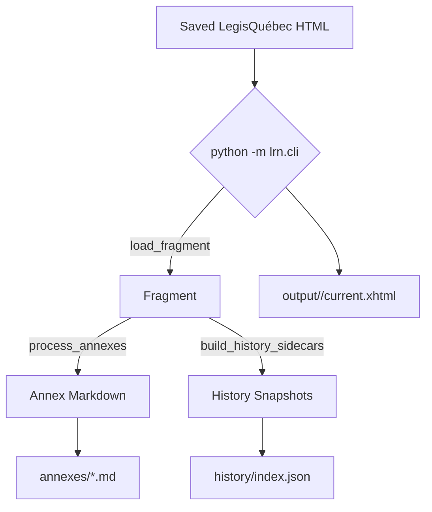
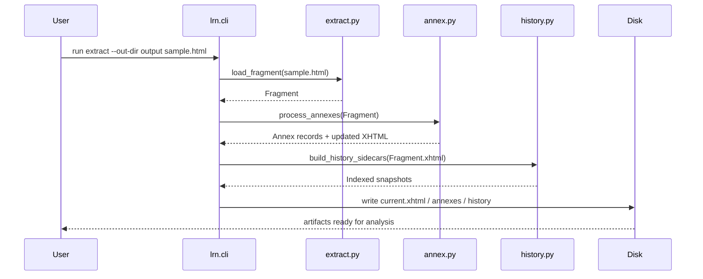
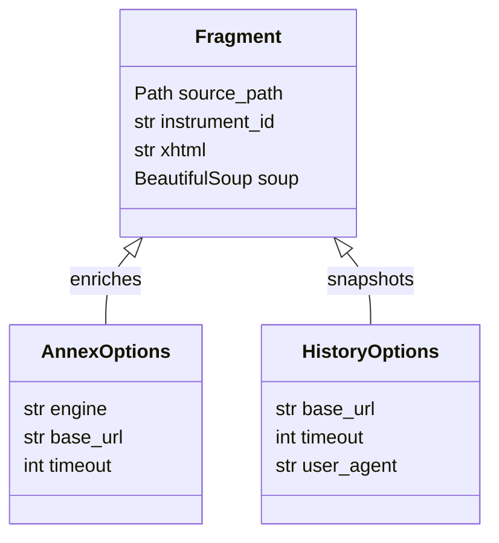
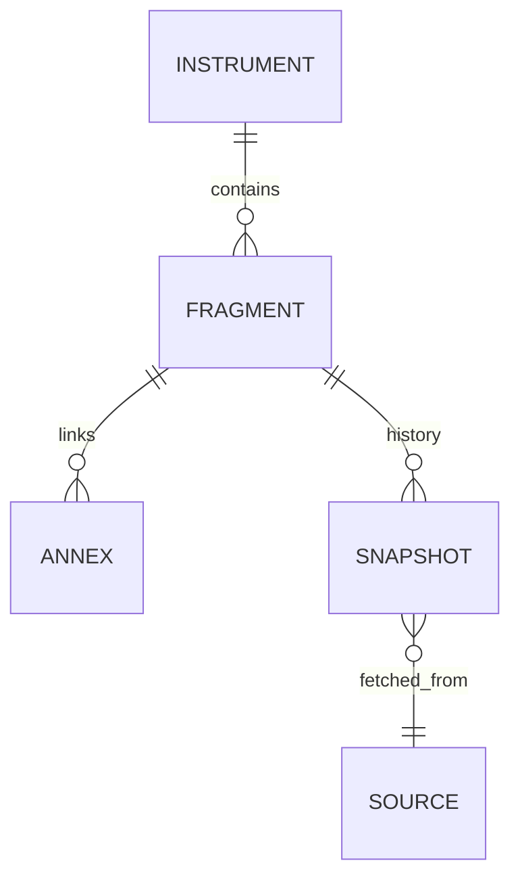
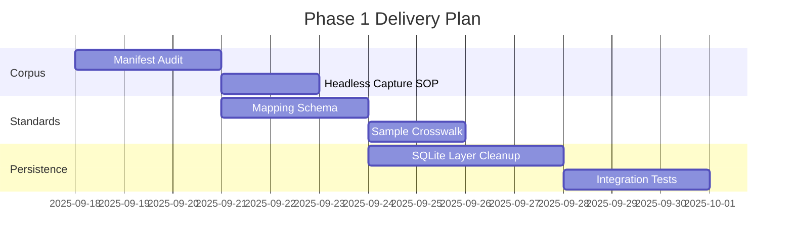
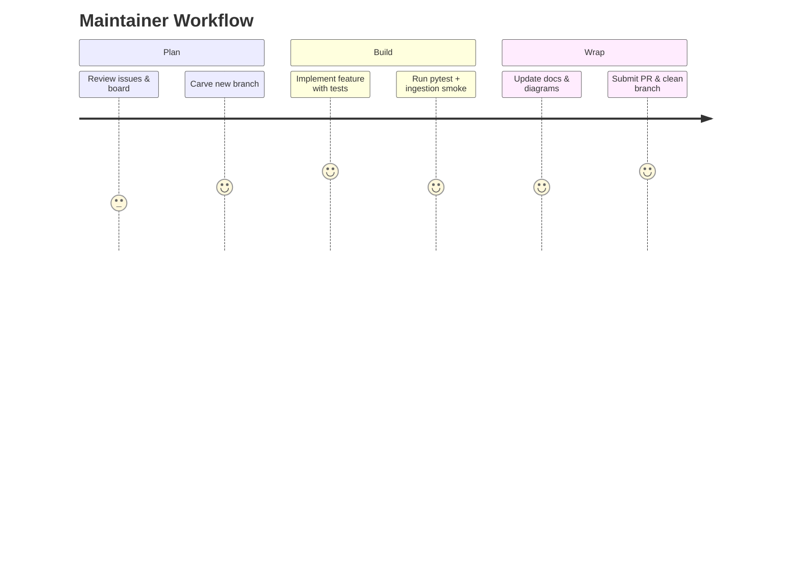

# LRN Extractor

Command-line tools for turning LegisQuébec HTML into clean XHTML fragments, annex Markdown sidecars, and history snapshots ready for downstream analysis.

## What It Does
- mirrors LegisQuébec landing pages (`Legisquebec originals/`) and extracts inner XHTML into `output/<instrument>/current.xhtml`.
- converts annex PDFs to GitHub-flavoured Markdown (via `marker`) and links the result back into the XHTML copy.
- crawls fragment history links and saves dated snapshots under `output/<instrument>/history/` with an accompanying `index.json`.
- operates fully offline with recorded fixtures so development and CI runs never touch production systems.

### Module Map
- `lrn/extract.py` — pure fragment loader (`load_fragment`) and instrument detection heuristics.
- `lrn/annex.py` — annex download + conversion pipeline with retries, size caps, and YAML provenance.
- `lrn/history.py` — history discovery, optional snapshotting, and HTML injection helpers.
- `lrn/cli.py` — orchestrates the modules and exposes the `extract` subcommand / fetch-all entrypoint.

## Quick Start
```bash
python -m lrn.cli extract --out-dir output path/to/local.html
# Prepare a manifest for batch ingestion (Phase 1 scaffold)
python scripts/corpus_ingest.py --manifest docs/corpus/example_phase1.json --out-dir logs/ingestion/demo
# Target provincial manifests (examples)
python scripts/corpus_ingest.py --manifest docs/corpus/manifests/nb.json --out-dir output_nb --log-dir logs/ingestion
python scripts/corpus_ingest.py --manifest docs/corpus/manifests/on.json --out-dir output_on --log-dir logs/ingestion --retries 2
# Window cleaning / fall protection pilots
python scripts/corpus_ingest.py --manifest docs/corpus/manifests/ab.json --out-dir output_ab --log-dir logs/ingestion
python scripts/corpus_ingest.py --manifest docs/corpus/manifests/bc.json --out-dir output_bc --log-dir logs/ingestion
python scripts/corpus_ingest.py --manifest docs/corpus/manifests/toronto.json --out-dir output_toronto --log-dir logs/ingestion
python scripts/corpus_ingest.py --manifest docs/corpus/manifests/nyc.json --out-dir output_nyc --log-dir logs/ingestion
python scripts/corpus_ingest.py --manifest docs/corpus/manifests/mb.json --out-dir output_mb --log-dir logs/ingestion
python scripts/corpus_ingest.py --manifest docs/corpus/manifests/sk.json --out-dir output_sk --log-dir logs/ingestion
python scripts/corpus_ingest.py --manifest docs/corpus/manifests/ns.json --out-dir output_ns --log-dir logs/ingestion
python scripts/corpus_ingest.py --manifest docs/corpus/manifests/nl.json --out-dir output_nl --log-dir logs/ingestion
python scripts/corpus_ingest.py --manifest docs/corpus/manifests/qc.json --out-dir output_qc --log-dir logs/ingestion
python scripts/corpus_ingest.py --manifest docs/corpus/manifests/montreal.json --out-dir output_montreal --log-dir logs/ingestion
python scripts/corpus_ingest.py --manifest docs/corpus/manifests/quebec_city.json --out-dir output_quebec_city --log-dir logs/ingestion --resume
python scripts/corpus_ingest.py --manifest docs/corpus/manifests/ca.json --out-dir output_ca --log-dir logs/ingestion
python scripts/corpus_ingest.py --manifest docs/corpus/manifests/pe.json --out-dir output_pe --log-dir logs/ingestion
python scripts/corpus_ingest.py --manifest docs/corpus/manifests/nt.json --out-dir output_nt --log-dir logs/ingestion
python scripts/corpus_ingest.py --manifest docs/corpus/manifests/nu.json --out-dir output_nu --log-dir logs/ingestion
python scripts/corpus_ingest.py --manifest docs/corpus/manifests/yk.json --out-dir output_yk --log-dir logs/ingestion
python scripts/corpus_ingest.py --manifest docs/corpus/manifests/osha.json --out-dir output_osha --log-dir logs/ingestion
python scripts/corpus_ingest.py --manifest docs/corpus/manifests/uk.json --out-dir output_uk --log-dir logs/ingestion
python scripts/corpus_ingest.py --manifest docs/corpus/manifests/eu.json --out-dir output_eu --log-dir logs/ingestion
python scripts/corpus_ingest.py --manifest docs/corpus/manifests/australia.json --out-dir output_au --log-dir logs/ingestion
python scripts/corpus_ingest.py --manifest docs/corpus/manifests/france.json --out-dir output_fr --log-dir logs/ingestion --resume
python scripts/corpus_ingest.py --manifest docs/corpus/manifests/germany.json --out-dir output_de --log-dir logs/ingestion
python scripts/corpus_ingest.py --manifest docs/corpus/manifests/japan.json --out-dir output_jp --log-dir logs/ingestion --resume
python scripts/corpus_ingest.py --manifest docs/corpus/manifests/china.json --out-dir output_cn --log-dir logs/ingestion --resume
```

Governance helper commands:
```bash
python runner.py --self-test              # verify governance templates match
python runner.py --apply --dry-run        # preview template updates
python runner.py --apply                  # sync governance templates
```
CanLII-guarded portals (AB, NL, NS, NT, NU, YK) and Quebec City’s façade bylaw
employ DataDome/anti-bot filters. Prime the download with
`scripts/headless_fetch.py` when a 403 appears, then rerun the ingestion command
with `--resume` so the session records checksums without retrying the blocked
URL. Install Playwright locally before using the fallback (`python -m pip install
playwright` followed by `playwright install chromium`).
API integrations:

```bash
# Temporarily export private credentials (do not commit)
set -a && source .env && set +a  # loads CANLII_API_KEY, GEMINI keys, etc.
export CANLII_API_KEY="<your-canlii-api-key>"
python scripts/corpus_ingest.py --manifest docs/corpus/manifests/ab.json --out-dir output_ab --log-dir logs/ingestion --resume
# Explore CanLII metadata for targets (metadata only)
python scripts/canlii_metadata.py qc --match safety --out logs/canlii_qc.json
```
`corpus_ingest` automatically attaches `X-API-Key` when `CANLII_API_KEY` is set and the manifest URL points at `api.canlii.org`.

> CanLII responses return metadata only (no statute text). Use the metadata to cross-check citations and then download the authoritative PDF/HTML from the source of record before extraction.

## Monitoring for Updates
Archive refreshed versions outside the repo and track checksums:

```bash
python scripts/monitor_updates.py \
  --manifest docs/corpus/manifests/sk.json \
  --archive-dir "$HOME/lrn-archives/sk" \
  --state logs/update_states/sk.json
```

`monitor_updates.py` saves new versions with timestamped filenames and updates the JSON state file so repeated runs only archive changed content. Point `--archive-dir` to a location excluded from git (e.g., home directory or shared storage).
Most manifests rely on CanLII API endpoints; export `CANLII_API_KEY` (e.g.,
`set -a && source .env && set +a`) before running the monitor so requests avoid
403 errors.

See `docs/corpus/monitoring.md` for known portal blockers (Nova Scotia Justice HTML-only pages, Newfoundland & Labrador JS error page) and guidance on filing follow-up issues.
Common flags:
- `--base-url`: resolve relative URLs when you are running against downloaded mirrors.
- `--annex-pdf-to-md/--no-annex-pdf-to-md`: enable or skip PDF → Markdown conversion.
- `--history-sidecars/--no-history-sidecars`: control history crawling.
- `--history-cache-dir`: reuse cached HTML during tests.

The default invocation (`python -m lrn.cli`) runs the “fetch all” workflow: it discovers FR/EN RC links, mirrors the pages locally, then extracts, converts annexes, and crawls history in one go.

## Development
- Keep regenerated artifacts out of git. The `.gitignore` already excludes `Legisquebec originals/`, `output/`, and logs.
- Install test deps with `pip install beautifulsoup4 lxml requests pytest`.
- Run tests with `python -m pytest`. Fixtures cover bilingual extraction, annex conversion stubs, and history crawling (success/failure).
- CI (`.github/workflows/ci.yml`) runs pytest on Python 3.10 and 3.11 with pip caching.
- `pyproject.toml` configures pytest discovery; `sitecustomize.py` injects the repo root into `sys.path` for local runs.
- Standards helpers (`lrn/standards`) provide `validate_mapping_file`; run via `python -m lrn.standards validate docs/standards/examples/sample.json`.

## Troubleshooting
- If annex conversion fails, the CLI logs a warning and leaves the PDF in place.
- History crawling falls back to the history-link URL when intermediate listing pages are unavailable (useful for offline tests).
- For noisy BeautifulSoup XML warnings during tests, installing `lxml` or filtering the warning will silence them.

## Roadmap & Issues
Active work and triage live on [Project 3](https://github.com/users/g0udurix/projects/3). Current focus includes Phase 1 (Corpus & Standards) deliverables and new ingestion pilots:

- #20–#24 LegisQuébec corpus scope, ingestion CLI, standards schema/tests, docs.
- #25–#33 Expansion research & manifests for other jurisdictions (NB, ON, AB, BC, OSHA 1910/1926, UK, France, Germany, Japan, China) with explicit fall-protection/window-cleaning coverage (e.g., ON Reg 859/90, BC Elevating Devices Safety Reg, UK Work at Height 2005, ArbSchG/BetrSichV, Japan Industrial Safety & Health) plus city/state pilots (Toronto, Vancouver, Montréal, Ville de Québec, NYC, Chicago, California Title 8).

## Branch Workflow
- Create feature branches only (e.g., `feat/history-sidecars-cache`); never commit directly to `master`.
- Keep scope focused: one feature or fix per branch with a linked issue and updated documentation/tests.
- Rebase or merge `master` before opening a PR, run `python -m pytest`, and document the exact commands executed in the PR template.
- After merge, delete the remote branch (`git push origin --delete <branch>`) and confirm the task is closed on Project 3.
- If a branch stalls, file or update an issue immediately so the work is visible on the board.


## Documentation Map
- Contributor playbooks: `AGENTS.MD`
- Agent briefs: `docs/agents/`
- Multitasking diagrams: `docs/diagrams/multitasking.md`
- Corpus manifests: `docs/corpus/`
- Issue dossiers: `docs/issues/`
- Standards schema: `docs/standards/`

## Project Management Checklist
- Update the [Project 3 Gantt view](https://github.com/users/g0udurix/projects/3/views/2) whenever scope changes or a task moves status.
- Use the helper (coming back via `runner.py`) to sync labels, workflows, and milestones after planning sessions.
- Pin a single owner per active branch to prevent parallel drift.
- Log test runs and ingestion outputs in `logs/` (git-ignored) and attach summaries to issues for traceability.
- Maintain `CHANGELOG.md` with user-visible updates for every merged branch.

## Visual Cheat Sheet

See `docs/diagrams/multitasking.md` for multi-agent parallel planning diagrams.

### Extraction Flow


### Sequence Overview


### Core Classes


### Entity Relationships


### Delivery Gantt


### User Journey


### Requirement Snapshot
```mermaid
requirementDiagram
    requirement R1 {
      id: R1
      text: Extract LegisQuébec XHTML deterministically
      risk: medium
      status: satisfied
    }
    requirement R2 {
      id: R2
      text: Convert annex PDFs to Markdown with provenance
      risk: medium
      status: satisfied
    }
    requirement R3 {
      id: R3
      text: Persist history snapshots with metadata
      risk: high
      status: in_progress
    }
    requirement R4 {
      id: R4
      text: Provide reproducible corpus ingestion via manifests
      risk: medium
      status: satisfied
    }
    R3 - component -> R1
    R3 - component -> R2
    R4 - satisfies -> R1
```

### Git History at a Glance

