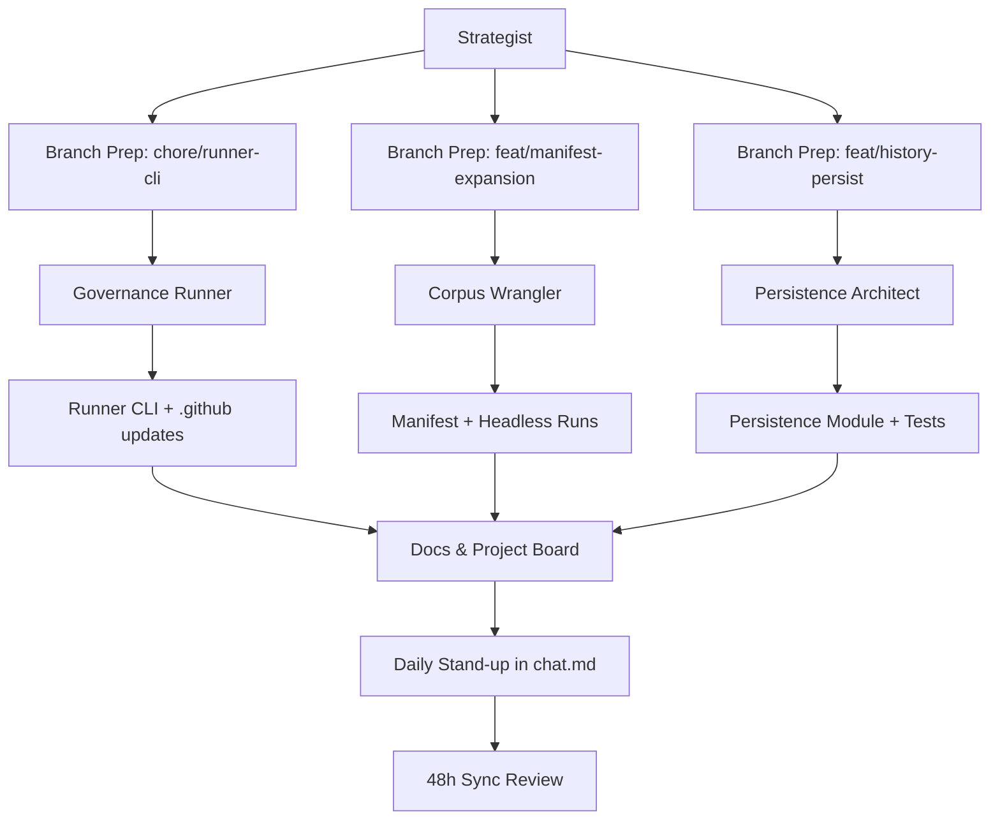
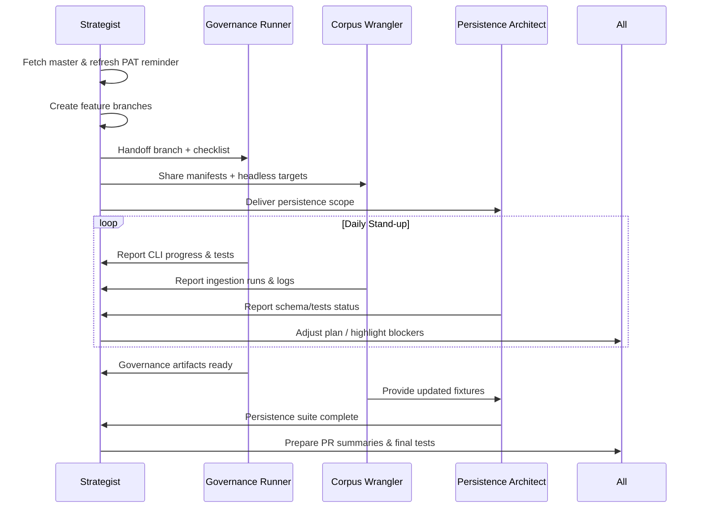
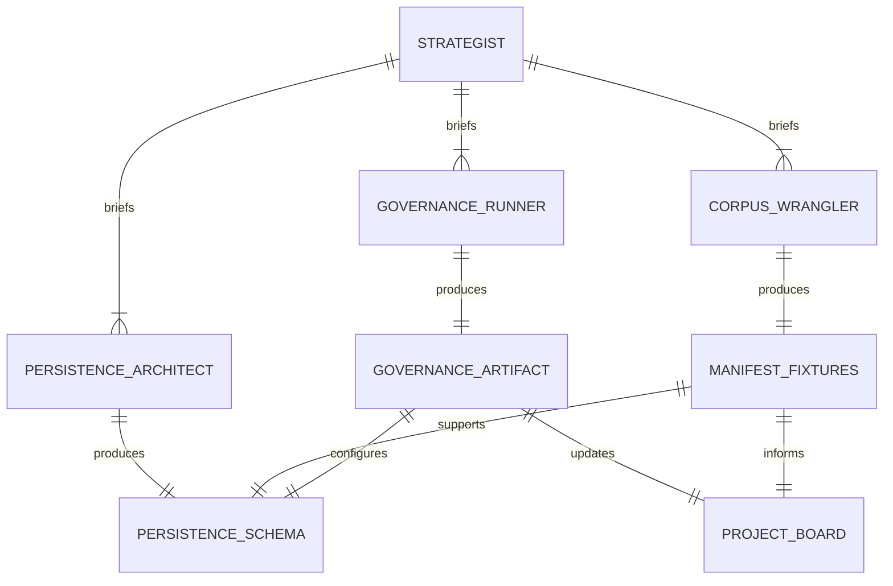
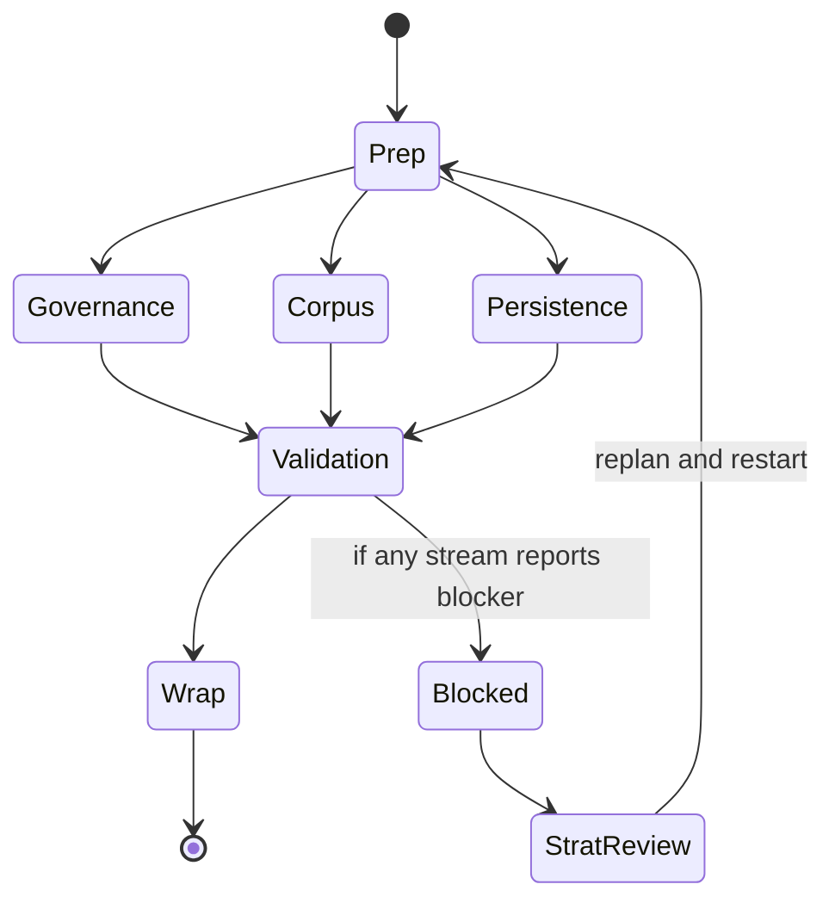
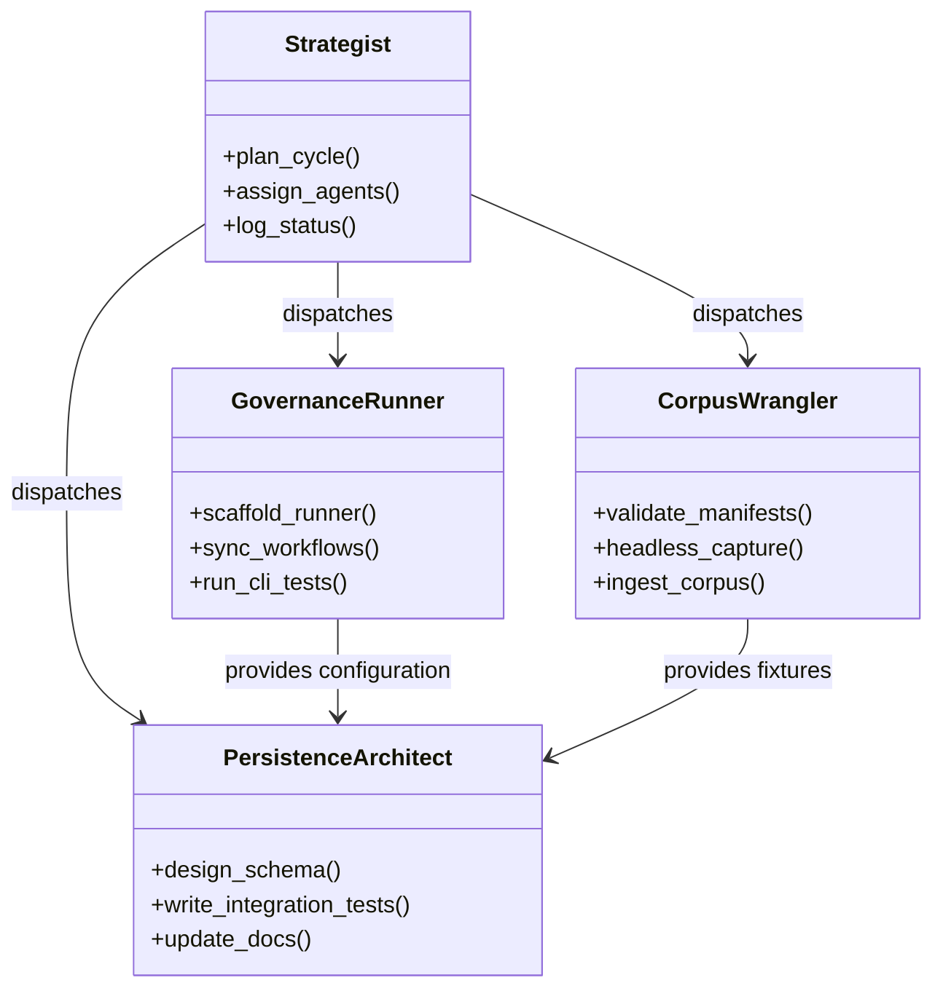

# Multitasking Strategy Diagrams

Visual guides for coordinating the parallel governance, corpus, and persistence streams.

## System Overview


## Swimlane Workflow


## Timeline
```mermaid
gantt
    title Parallel Stream Timeline
    dateFormat  YYYY-MM-DD
    section Prep
    PAT Refresh & Branch Carve         :a1, 2025-09-18, 1d
    section Governance
    Runner CLI Scaffold                :b1, after a1, 2d
    CI/Docs Update                     :b2, after b1, 1d
    section Corpus
    Manifest QA & Headless Captures    :c1, after a1, 2d
    Ingestion Logs & Issue Updates     :c2, after c1, 1d
    section Persistence
    Schema Draft & Fixtures            :d1, after c2, 2d
    Integration Tests & Docs           :d2, after d1, 2d
    section Wrap
    Full Pytest + PR Packaging         :e1, after b2, c2, d2, 1d
```

## Dependency Matrix


## Status Flow


## Agent Class Model


## Git Branch Plan


